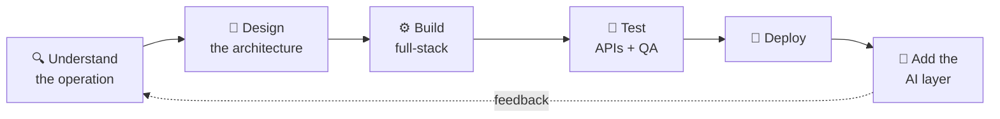

<div align="center">


<a href="#"></a>

<br/>


</div>

<br/>

## 🧭 Overview

I'm a **Computer Scientist turned full-stack engineer** with 5+ years across freelance client delivery and in-house engineering. I've designed and deployed **POS systems, travel and event portals, share-management systems, and nationwide logistics and database infrastructure**, so I know how custom technology actually powers day-to-day operations.

Every build ships with **hands-on API testing and QA**. Reliability is a requirement, not an afterthought.

Now I'm pushing further: **AI as core functionality**, not a bolt-on. My goal is to be the technical lead clients trust to bring meaningful AI into their systems, on tested architecture instead of hype.

---

## 🗺️ How I Work



---

## 🃏 Player Card

<div align="center">


<sub>Rated my own CS skills like an EA FC card. Algorithms keep me grounded, systems make me humble.</sub>

</div>

---

## ⚡ What I Build

<table>
<tr>
<td width="25%" align="center">🤖<br/><b>Smart Automation</b><br/><sub>Workflow copilots</sub></td>
<td width="25%" align="center">💬<br/><b>AI Chat Assistants</b><br/><sub>Talk to your data</sub></td>
<td width="25%" align="center">🔮<br/><b>Predictive Insights</b><br/><sub>Forecasting in daily ops</sub></td>
<td width="25%" align="center">🔍<br/><b>Natural Language Search</b><br/><sub>Ask, don't filter</sub></td>
</tr>
<tr>
<td align="center">📑<br/><b>Auto Reports</b><br/><sub>Reports that write themselves</sub></td>
<td align="center">🚨<br/><b>Anomaly Detection</b><br/><sub>Catch what shouldn't be there</sub></td>
<td align="center">♻️<br/><b>Self-Optimizing Ops</b><br/><sub>Systems that tune themselves</sub></td>
<td align="center">🏗️<br/><b>Custom Platforms</b><br/><sub>POS, logistics, portals</sub></td>
</tr>
</table>

---

## 🧰 Toolbox

<div align="center">

<br/>
<br/>
<br/>


<sub>Also: Odoo · Insomnia</sub>

</div>

---

## 🚀 Featured Work

| | Project | What it does | Stack |
|:-:|---|---|---|
| 🚛 | **LoadHub** | Freight dashboard covering loads, drivers, invoicing, and settlements | React · TypeScript · Firebase |
| 🛡️ | **Perimeter** | API security and auth SaaS landing page | React · TypeScript |
| 📡 | **PXL** | AI-powered API testing and observability platform | Full-stack |
| 🍽️ | **Restaurant POS** | Orders, tables, billing, inventory, and bookkeeping | Full-stack |
| 🧺 | **Xtra Clean Laundry** | Dry-cleaning management app for a real client | Full-stack |

---

## 🎮 Off the Clock: Side Quests

<div align="center">

<a href="#"></a>

</div>

<br/>

<table>
<tr>
<td width="20%" align="center" valign="top">
<h1>🎮</h1>
<b>EA FC</b><br/>
<sub>Competitive grind.<br/>Pixels with stakes.</sub>
</td>
<td width="20%" align="center" valign="top">
<h1>♟️</h1>
<b>Chess</b><br/>
<sub>Thinking three moves ahead. Same skill, different board.</sub>
</td>
<td width="20%" align="center" valign="top">
<h1>⚽🏀</h1>
<b>Football + NBA</b><br/>
<sub>Match day is<br/>a scheduled event.</sub>
</td>
<td width="20%" align="center" valign="top">
<h1>🕹️</h1>
<b>Retro Consoles</b><br/>
<sub>Opening them up just to see what's possible under the hood.</sub>
</td>
<td width="20%" align="center" valign="top">
<h1>🚀</h1>
<b>Sci-Fi</b><br/>
<sub>Imagined future tech.<br/>My roadmap inspiration.</sub>
</td>
</tr>
</table>

```text
 PLAYER 1  //  SIDE QUEST LOG
 ------------------------------------------------
  COMPETE     [##################--]   ALWAYS ON
  STRATEGY    [###################-]   CHESS MODE
  TINKERING   [################----]   HARDWARE
  IMAGINATION [####################]   SCI-FI MAX
 ------------------------------------------------
  ACHIEVEMENT UNLOCKED:
  "Opened an old console just to see what's inside"
```

<div align="center">


</div>

---

## 📊 Activity

<div align="center">


</div>

---

<div align="center">

### 📬 Got an operation that needs smarter software?

Currently integrating AI-driven capabilities into production systems for agency and enterprise clients. **Open to collaborating.**

[](mailto:your-email@example.com)
[](#)
[](https://x.com/jossi30)
[](https://github.com/jossi30)

<sub>Built by <b>jpulse systems</b></sub>


</div>
